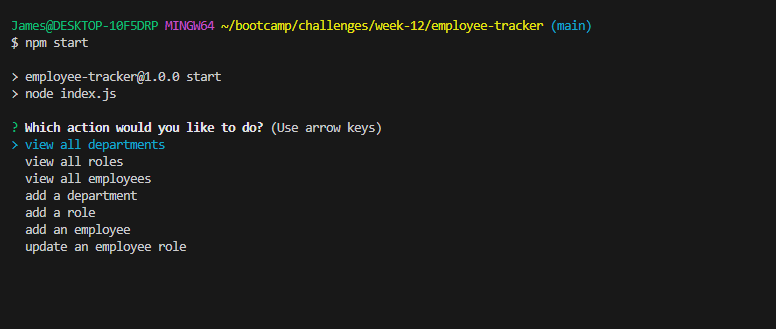
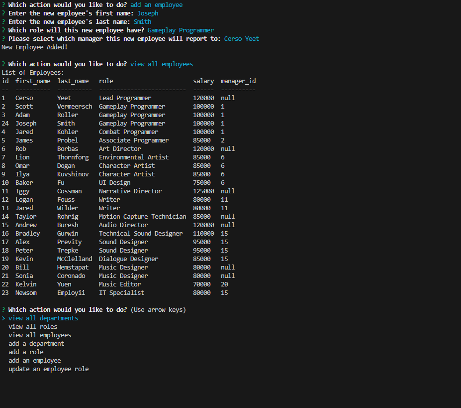
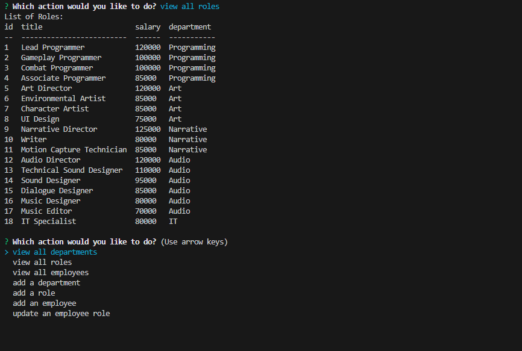

# Employee Tracker

## Description

Database management is a crucial part of an organization's success. On top of that, it's important to use databases and tables to store data so that our information can be accessed and stored in a streamlined way. This terminal-level employee tracker application utilizes MySQL to store departments, roles, and employee information in a database for an example company.

Using SQL database queries combined with NPM Inquirer, this application gives users an easy way to view, add, or update information in tables within the company's database. This was a great project to learn the best ways to structure queries that take in user input, and for some options, nesting queries within each other.

## Installation

Clone the repository and install all NPM dependencies (inquirer v8.2.4, mysql2, console.table). You must also have Node.js installed and working properly.

Ensure that your mysql user and password is correct at the top of `lib/queries/queries.js`

## Usage

Please watch the video demonstration found [here!](https://drive.google.com/file/d/1vpHk6OfrxN45TLmKAzYXq7vfaGmI0o0v/view?usp=sharing)

Enter the MySQL shell and run the schema.sql, and seeds.sql file found in the `db` folder.

Start the program by typing `npm start` or `node index.js` in the terminal.

Users will then be greeted with multiple options:
* view all departments
* view all roles
* view all employees
* add a department
* add a role
* add an employee
* update an employee role

For the "view" options, users will see a resulting table in the console that showcases the departments/roles/employees, along with relavent information.

The other options require user input:
* add a department: enter the department name
* add a role: enter the new role name, salary, and what department the role belongs in
* add an employee: enter the first name, last name, role, and manager of the new employee
* update an employee role: select the employee from the list, then select their new role

## Credits

Application created by me, James Probel, with guidelines from the UNC Chapel Hill Programming Bootcamp

Thanks to W3 Schools for refresher guidelines on MySQL queries:
https://www.w3schools.com/mysql/mysql_sql.asp

Thanks to NPM console.table for providing a clean format for the data:
https://www.npmjs.com/package/console.table

